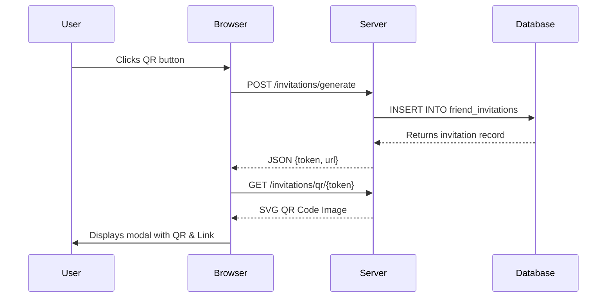
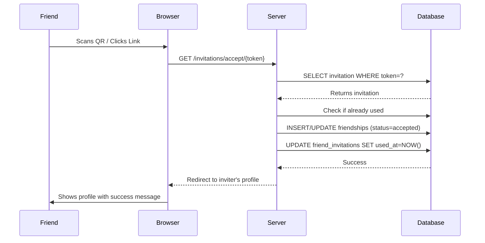

# QR Code & Invitation Link System Documentation

## 📋 Overview

This system allows users to share their profile via **QR Code** or **Invitation Link**. When someone scans the QR code or clicks the link, they are **automatically added as friends** (no manual approval needed).

---

## 🏗️ Architecture

### Database Schema

**Table:** `friend_invitations`

```sql
CREATE TABLE friend_invitations (
    id BIGINT PRIMARY KEY AUTO_INCREMENT,
    user_id BIGINT NOT NULL,              -- Who created the invitation
    token VARCHAR(255) UNIQUE NOT NULL,   -- Random unique string
    used_at TIMESTAMP NULL,               -- When someone used it (NULL = unused)
    created_at TIMESTAMP,
    updated_at TIMESTAMP,
    FOREIGN KEY (user_id) REFERENCES users(id) ON DELETE CASCADE
);
```

**Purpose of each column:**
- `user_id`: Links the invitation to the user who created it
- `token`: A 32-character random string (e.g., `a7f3k9m2p5q8r1t4v6w9x2y5z8b1c4d6`)
- `used_at`: Prevents reuse of the same invitation (security feature)

---

## 📁 File Structure

```
app/
├── Http/Controllers/
│   └── InvitationController.php    # Main logic for QR/Link system
├── Models/
│   ├── FriendInvitation.php        # Invitation model
│   └── User.php                    # Added friendInvitations() relationship

database/migrations/
└── 2026_02_11_091109_create_friend_invitations_table.php

resources/views/user/
└── profile.blade.php               # UI with QR button and modal

routes/
└── web.php                         # Routes for generate, showQR, accept
```

---

## 🔧 Backend Components

### 1. InvitationController

**Location:** `app/Http/Controllers/InvitationController.php`

#### Method: `generate()`
**Route:** `POST /invitations/generate`

**What it does:**
1. Creates a new row in `friend_invitations` table
2. Generates a random 32-character token
3. Returns JSON with the token and full URL

**Example Response:**
```json
{
  "token": "a7f3k9m2p5q8r1t4v6w9x2y5z8b1c4d6",
  "url": "https://yourapp.com/invitations/accept/a7f3k9m2p5q8r1t4v6w9x2y5z8b1c4d6"
}
```

**Code:**
```php
public function generate()
{
    $invitation = FriendInvitation::create([
        'user_id' => Auth::id(),
        'token' => Str::random(32),
    ]);

    return response()->json([
        'token' => $invitation->token,
        'url' => route('invitations.accept', $invitation->token)
    ]);
}
```

---

#### Method: `showQR($token)`
**Route:** `GET /invitations/qr/{token}`

**What it does:**
1. Finds the invitation by token
2. Generates a QR code image (SVG format) containing the acceptance URL
3. Returns the image

**QR Code Library:** `bacon/bacon-qr-code` v3 (already installed with Laravel Fortify)

**Code:**
```php
public function showQR($token)
{
    $invitation = FriendInvitation::where('token', $token)->firstOrFail();
    
    $url = route('invitations.accept', $token);
    
    $renderer = new ImageRenderer(
        new RendererStyle(300),        // 300x300 pixels
        new SvgImageBackEnd()          // SVG format (scalable)
    );
    $writer = new Writer($renderer);
    $qrCode = $writer->writeString($url);

    return response($qrCode)->header('Content-Type', 'image/svg+xml');
}
```

**Why SVG?** Vector format stays sharp at any size, perfect for QR codes.

---

#### Method: `accept($token)`
**Route:** `GET /invitations/accept/{token}`

**What it does:**
1. Validates the invitation token
2. Checks if already used (security)
3. Prevents self-acceptance
4. Creates or updates friendship with `status = 'accepted'`
5. Marks invitation as used
6. Redirects to the inviter's profile

**Security Checks:**
- ✅ Token must exist in database
- ✅ Token must not be already used
- ✅ Cannot accept your own invitation
- ✅ Handles existing friendship requests

**Code:**
```php
public function accept($token)
{
    $invitation = FriendInvitation::where('token', $token)->firstOrFail();

    // Security: Check if already used
    if ($invitation->isUsed()) {
        return redirect()->route('dashboard')
            ->with('error', 'This invitation has already been used.');
    }

    // Security: Prevent self-acceptance
    if ($invitation->user_id === Auth::id()) {
        return redirect()->route('dashboard')
            ->with('error', 'You cannot accept your own invitation.');
    }

    // Check if friendship already exists (in either direction)
    $existing = Friendship::where(function($q) use ($invitation) {
        $q->where('requester_id', Auth::id())
          ->where('addressee_id', $invitation->user_id);
    })->orWhere(function($q) use ($invitation) {
        $q->where('requester_id', $invitation->user_id)
          ->where('addressee_id', Auth::id());
    })->first();

    if (!$existing) {
        // Create new friendship (auto-accepted)
        Friendship::create([
            'requester_id' => $invitation->user_id,
            'addressee_id' => Auth::id(),
            'status' => 'accepted'
        ]);
    } else {
        // Update existing request to accepted
        $existing->update(['status' => 'accepted']);
    }

    // Mark invitation as used (prevents reuse)
    $invitation->markAsUsed();

    return redirect()->route('user.show', $invitation->user_id)
        ->with('success', 'Friendship accepted!');
}
```

---

### 2. FriendInvitation Model

**Location:** `app/Models/FriendInvitation.php`

**Key Methods:**

```php
class FriendInvitation extends Model
{
    protected $fillable = ['user_id', 'token', 'used_at'];

    // Relationship to the user who created this invitation
    public function user()
    {
        return $this->belongsTo(User::class);
    }

    // Check if invitation has been used
    public function isUsed()
    {
        return $this->used_at !== null;
    }

    // Mark invitation as used (sets timestamp)
    public function markAsUsed()
    {
        $this->update(['used_at' => now()]);
    }
}
```

---

### 3. User Model Update

**Location:** `app/Models/User.php`

**Added Relationship:**
```php
public function friendInvitations()
{
    return $this->hasMany(FriendInvitation::class);
}
```

This allows you to get all invitations created by a user:
```php
$user->friendInvitations; // Returns collection of FriendInvitation models
```

---

## 🎨 Frontend Components

### Profile Page UI

**Location:** `resources/views/user/profile.blade.php`

#### 1. QR Button
```html
<button onclick="openQRModal()" 
        class="w-9 h-9 rounded-full border border-gray-300 
               flex items-center justify-center 
               hover:bg-gray-100 transition-colors group" 
        title="Show QR Code">
    <span class="material-symbols-outlined text-[20px] 
                 text-slate-600 group-hover:text-primary 
                 transition-colors">qr_code_2</span>
</button>
```

#### 2. QR Modal
A glassmorphism-style popup with:
- QR code image display
- Invitation link with copy button
- Loading spinner
- Close button

#### 3. JavaScript Logic

**Opening the Modal:**
```javascript
function openQRModal() {
    const modal = document.getElementById('qr-modal');
    const content = document.getElementById('qr-modal-content');
    const qrImage = document.getElementById('qr-image');
    const loading = document.getElementById('qr-loading');
    const linkText = document.getElementById('invite-link-text');
    
    // Show modal with animation
    modal.classList.remove('hidden');
    modal.classList.add('flex');
    
    setTimeout(() => {
        content.classList.remove('scale-95', 'opacity-0');
        content.classList.add('scale-100', 'opacity-100');
    }, 50);

    // Fetch new token from backend (AJAX)
    fetch('/invitations/generate', {
        method: 'POST',
        headers: {
            'X-CSRF-TOKEN': document.querySelector('meta[name="csrf-token"]').content,
            'Accept': 'application/json',
        }
    })
    .then(r => r.json())
    .then(data => {
        // Update QR image source
        qrImage.src = '/invitations/qr/' + data.token;
        qrImage.onload = () => {
             loading.classList.add('hidden');
             qrImage.classList.remove('hidden');
        };
        // Update link text
        linkText.innerText = data.url;
    })
    .catch(err => {
        console.error('Error generating invitation:', err);
        linkText.innerText = 'Error generating link';
        loading.classList.add('hidden');
    });
}
```

**Copy Link Function:**
```javascript
function copyInviteLinkFromModal() {
    const linkText = document.getElementById('invite-link-text').innerText;
    if (linkText === 'Generating link...' || linkText === 'Error generating link') return;

    navigator.clipboard.writeText(linkText).then(() => {
        const btn = event.target;
        const originalText = btn.innerText;
        btn.innerText = 'Copied!';
        btn.classList.add('text-green-600');
        
        setTimeout(() => {
            btn.innerText = originalText;
            btn.classList.remove('text-green-600');
        }, 2000);
    });
}
```

---

## 🔄 Complete Flow

### User Journey: Creating an Invitation



### Friend Journey: Accepting an Invitation



---

## 🔒 Security Features

1. **One-Time Use:** Each invitation can only be used once (`used_at` timestamp)
2. **No Self-Acceptance:** You cannot accept your own invitation
3. **Token Validation:** Invalid tokens return 404 errors
4. **CSRF Protection:** All POST requests require CSRF token
5. **Authentication Required:** Must be logged in to accept invitations
6. **Cascade Delete:** Invitations are deleted when user is deleted

---

## 🧪 Testing the Feature

### Manual Testing Steps:

1. **Generate QR Code:**
   - Go to your profile
   - Click the QR icon button
   - Verify modal opens with QR code and link

2. **Copy Link:**
   - Click "Copy Link" button
   - Verify "Copied!" feedback appears
   - Paste link in a new tab

3. **Accept Invitation:**
   - Open the link in another browser/incognito (as different user)
   - Verify you're redirected to the inviter's profile
   - Check that friendship exists in database

4. **Reuse Prevention:**
   - Try using the same link again
   - Verify error message appears

---

## 📦 Dependencies

- **bacon/bacon-qr-code** v3.0.3 (already installed with Laravel Fortify)
- No additional packages needed!

---

## 🚀 Future Enhancements

Possible improvements:
- [ ] Add expiration time for invitations (e.g., 24 hours)
- [ ] Track invitation usage statistics
- [ ] Allow custom invitation messages
- [ ] Generate multiple invitations at once
- [ ] Add invitation history page
- [ ] Support for group invitations

---

## 🐛 Troubleshooting

### QR Code Not Showing
- Check if `bacon/bacon-qr-code` is installed: `composer show bacon/bacon-qr-code`
- Verify route is registered: `php artisan route:list | grep invitation`

### "Invitation already used" Error
- Check `used_at` column in database
- Generate a new invitation

### JavaScript Not Working
- Check browser console for errors
- Verify CSRF token is present in page meta tags

---

## 📚 Related Files

- Migration: `database/migrations/2026_02_11_091109_create_friend_invitations_table.php`
- Controller: `app/Http/Controllers/InvitationController.php`
- Model: `app/Models/FriendInvitation.php`
- View: `resources/views/user/profile.blade.php`
- Routes: `routes/web.php` (lines with `invitations`)

---

**Last Updated:** 2026-02-11  
**Version:** 1.0
